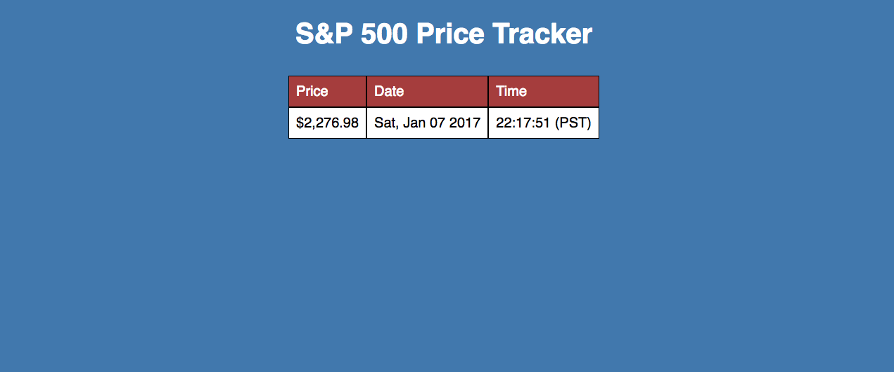

##StockTracker




### Background
StockTracker a web scraper that programmatically reflects the S&P 500's quote from CNN using JavaScript and jQuery. Since the original data is pulled through a websocket connection, there was no API available for HTTP requests. In addition, due to the same origin policy, I had to use a work around to make a cross-domain request. The Yahoo! Query Language (YQL) allows you to load any HTML document and get it back in JSON so I ended up using [James Padolsey's jQuery Plugin](https://github.com/padolsey-archive/jquery.fn/tree/master/cross-domain-ajax) which leverages YQL to make cross-domain requests.


### Implementation Details
Each second, the app makes an AJAX GET request to CNN Money and pulls the current price. It checks that price against the last price in the table and append a row to the table if the price changed.


```javascript

function pullPrice() {
  $.ajax({
      url: 'http://money.cnn.com/data/markets/sandp/',
      type: 'GET',
      success: function(res) {
          let result = $(res.responseText).find(".wsod_last").find("span")[0].innerHTML;
          let container = document.getElementById("container");
          if (prices.length < 1 || prices[prices.length - 1].result !== result) {
            let totalDate = new Date().toString().replace(" ", ", ").replace("GMT-0800", "")
            let date = totalDate.slice(0,-15);
            let time = totalDate.slice(-15);
            prices.push({result: result, date: date, time: time});
            container.innerHTML = `<span>` + `<li>Price</li>` + prices.map((price) => `<li>$${price.result}</li>`).join(" ") + `</span>`
            container.innerHTML +=  `<span>` +`<li>Date</li>` + prices.map((price) => `<li>${price.date}</li>`).join(" ") + `</span> `
            container.innerHTML += `<span>` +`<li>Time</li>` + prices.map((price) => `<li>${price.time}</li>`).join(" ") + `</span>`;
          }
      }
  });
}

setInterval(pullPrice, 1000);
```
